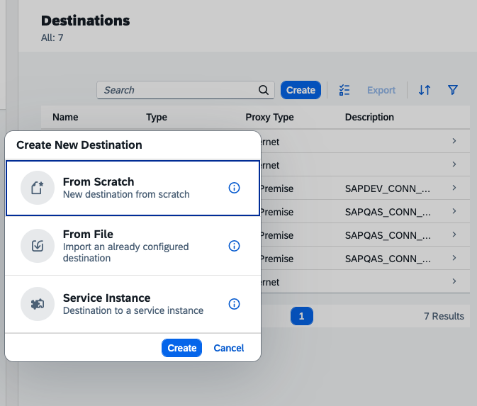

# Crear Destino

Paso 1: Crear el Destino en el Cockpit de BTP

1. Entra a tu subcuenta en SAP BTP Cockpit.
2. En el menú izquierdo, ve a Connectivity > Destinations.
3. Haz clic en New Destination, selecciona la primera opción.
4.  
5. Añade los datos necesarios para crear el destino:

<figure><figcaption></figcaption></figure>

1. Name: "según nomenclatura del proyecto" _(es vital que te quedes con este nombre exacto)._
2. Type: HTTP
3. URL:  Debes poner la URL real que te escupió la consola cuando hiciste el cf push de tu Node.js (por ejemplo: https://user-info-fast-hippo-xx.cfapps.eu10.hana.ondemand.com).
4. Proxy Type: Internet
5. Authentication: NoAuthentication
6. En la sección Additional Properties, haz clic en el botón "New Property" para añadir estas 4 exactamente (respeta mayúsculas y minúsculas):
7. forwardAuthToken = true
8. HTML5.DynamicDestination = true
9. WebIDEEnabled = true
10. WebIDEUsage = odata\_gen
11. Guarda el destino (haz clic en Save).
12. Dale al botón Check Connection. _(Ojo: Te dirá "200 OK" o quizás "401 Unauthorized" porque el check se hace sin token, no te asustes si sale 401, significa que el servidor responde)._

.png>) 
