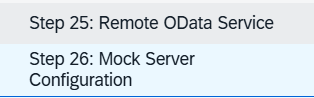

# Preguntas Equipo 2

* Esta manera de tratar los datos es unica, de SAP. ¿Qué ventajas tiene respecto a como se tratan los datos en java? Porque se centra mucho en negocio?

```xml
<!--Único de SAP Fiori, esta pensado para datos complejos de negocio, permite separar visual ente el nombre del objeto de su valor númerico y su unidad. -->
               <ObjectListItem id="Objeto"
                  title="{invoice>ProductName}"
                  number="{
                     parts: [
                        {path: 'invoice>ExtendedPrice'},
                        'view>/currency'
                           ],
                        type: 'sap.ui.model.type.Currency',
                        formatOptions: {
                        showMeasure: false
                        }
                        }"
                        numberUnit="{view>/currency}" 
                        numberState="{= ${invoice>ExtendedPrice} > 50 ? 'Error' : 'Success' }" /> <!--mostrar un error cuando sea mayor que 50-->
```

* Ficheros JSON entendidos, pero me gustaría que me explicarán que métodos tiene OModel (JSON), como se crea el modelo y que consulta: (me cuesta entenderlo, es una libreria que llamamos, pero se utiliza para consultar...): Modelo vista..., únicamente es una forma de modular?

```javascript
     onInit: function () {
        // Creamos un modelo de vista para definir que la moneda es EUR
        var oViewModel = new JSONModel({
            currency: "EUR" //tipo de moneda, ventaja de modular para cuando se tenga que cambiar, solo se cambie esta linea. 
         });
        this.getView().setModel(oViewModel, "view");
        }
```

* Diferencia entre función onInit() y función event y función del dialogo que no es un evento: Programación de eventos he programado, con javaBeans,  se lo que es conceptualmente, la función onInit() no acabo de entenderla.

```javascript
onInit: function () {
        // Creamos un modelo de vista para definir que la moneda es EUR
        var oViewModel = new JSONModel({
            currency: "EUR" //tipo de moneda, ventaja de modular para cuando se tenga que cambiar, solo se cambie esta linea. 
         });
        this.getView().setModel(oViewModel, "view");
        },
```

```javascript
        onFilterInvoices: function (oEvent) {
            // 3. Obtener el texto que ha escrito el usuario
            var sQuery = oEvent.getParameter("query");
            var aFilter = [];
            
            if (sQuery) {
                // Creamos un filtro que busque en 'ProductName'
                aFilter.push(new Filter("ProductName", FilterOperator.Contains, sQuery));
            }

            // 4. Aplicar el filtro a la lista
            var oList = this.byId("listadoModelo");
            var oBinding = oList.getBinding("items");
            oBinding.filter(aFilter);
        }
```

```javascript
        onOpenDialog: function () {
        // Le pedimos al Componente que abra el diálogo por nosotros
        this.getOwnerComponent().openHelloDialog();
        },
```

El punto 25 y 26, no he conseguido conectarlo con OData:&#x20;

<figure><figcaption></figcaption></figure>

